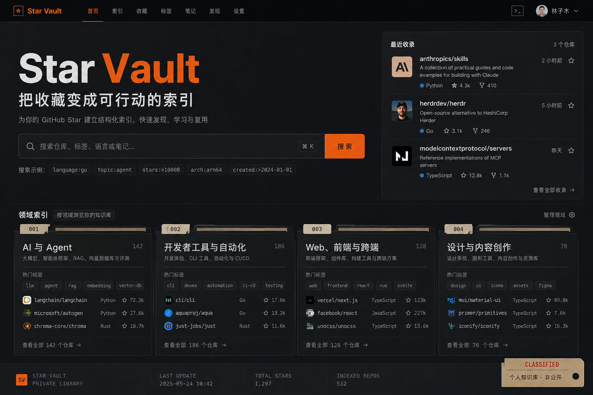
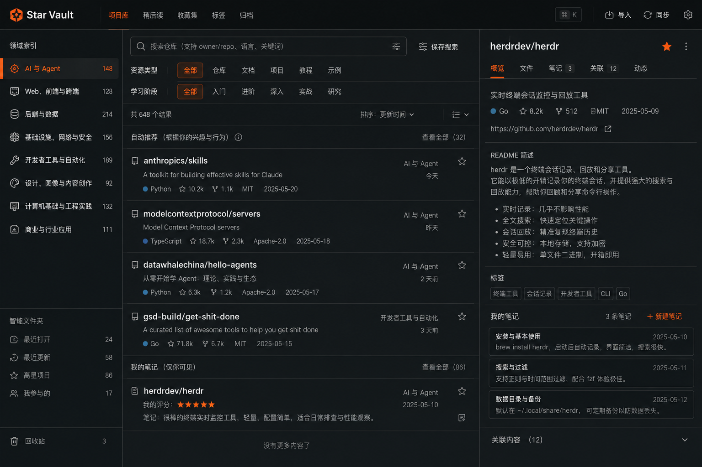
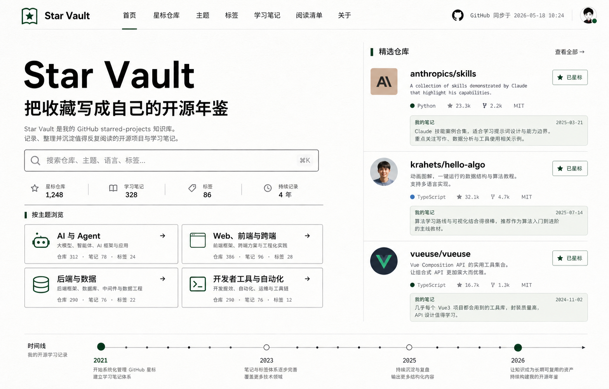
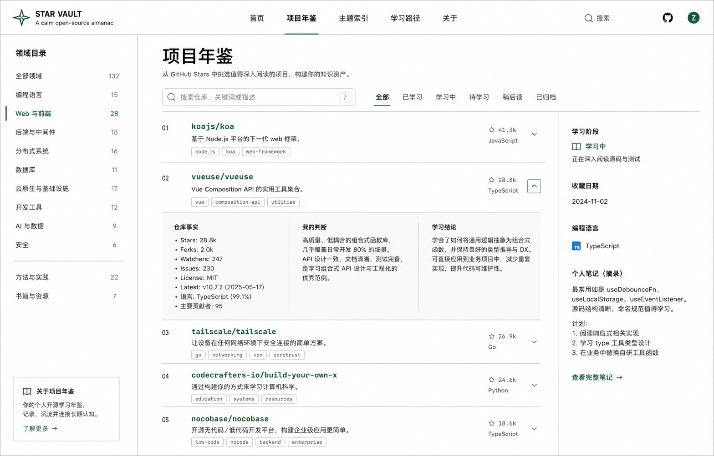
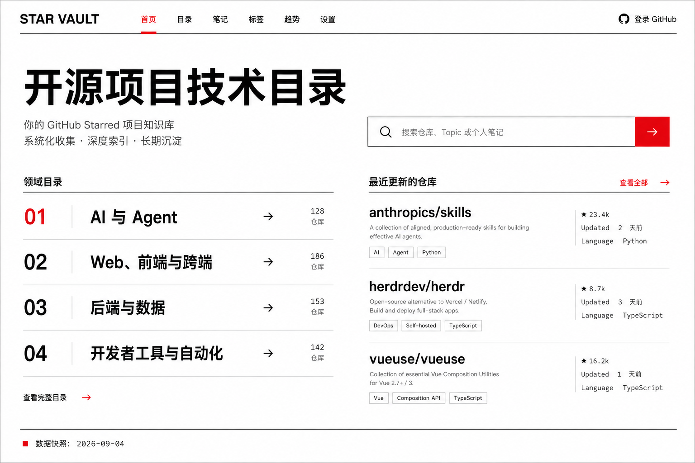
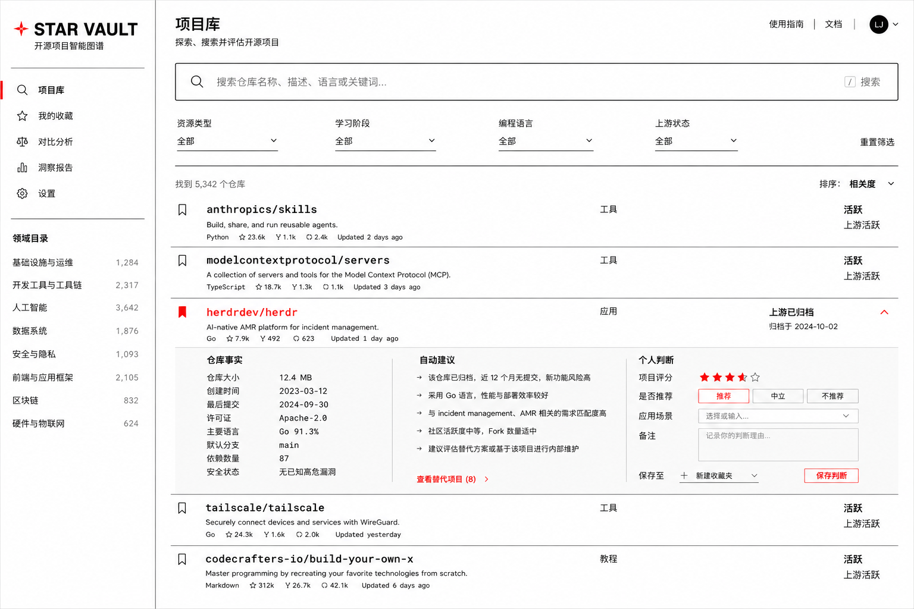
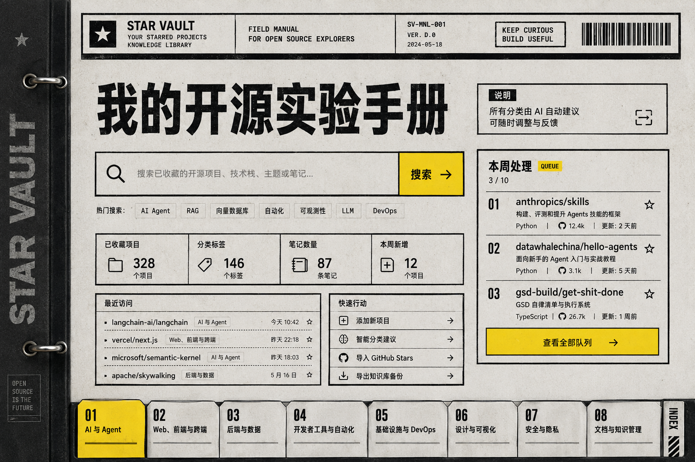
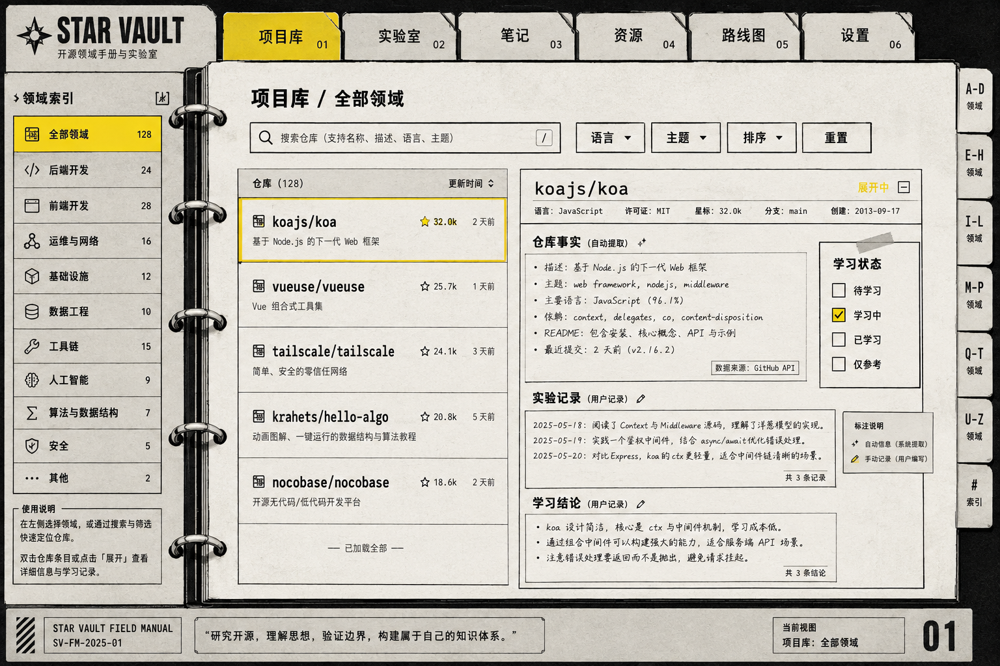
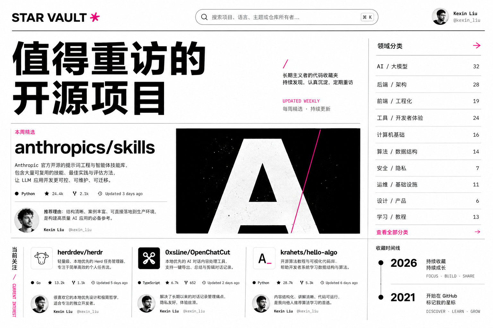
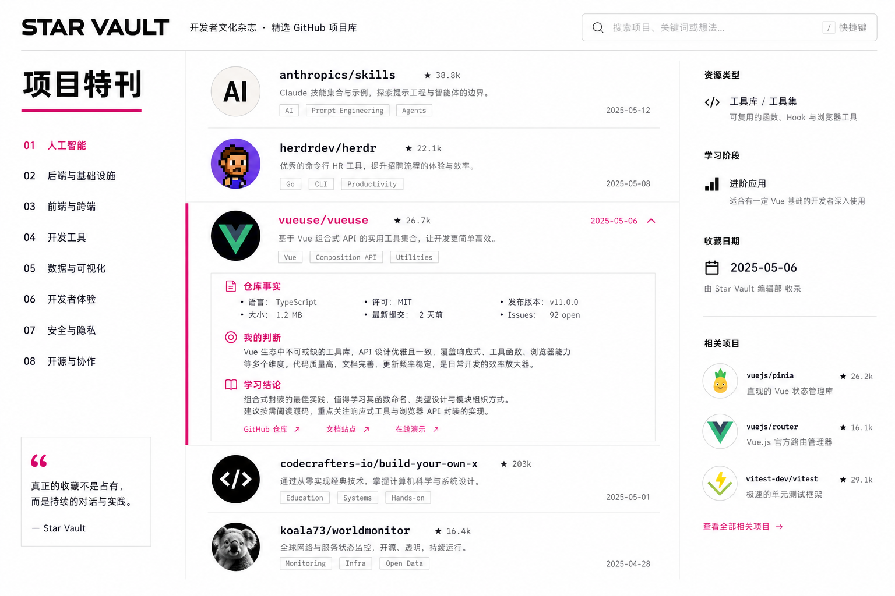

# GitHub Star Vault 视觉方向探索

本目录包含五套由 `design-taste-frontend` 约束、使用内置 `imagegen` 生成的界面概念。它们只用于选择视觉语言和信息布局，不是可运行页面。

生成图中的仓库数量、Stars、日期、描述和个人笔记可能是视觉占位。正式产品只能使用同步快照和用户确认过的内容。

## 方案 A：工业索引台

**Design Read**：面向高频使用者的个人开发者工具，强调搜索、筛选和快速进入项目详情。

- `DESIGN_VARIANCE: 8`
- `MOTION_INTENSITY: 5`
- `VISUAL_DENSITY: 7`
- 配色：石墨黑、冷灰、单一安全橙
- 字体：粗体 Grotesk 搭配克制的等宽元数据
- 首页重点：命令式搜索、最近收藏、领域索引
- 项目库重点：左侧分类、中间列表、右侧详情三栏同时可见

它适合把 Star Vault 做成每天使用的个人工作台。优点是操作效率高、产品性格强、分类始终可见；代价是暗色和高密度会提高初次使用成本，公开访客阅读长内容时也更容易疲劳。

## 方案 B：开源年鉴

**Design Read**：面向本人和公开读者的长期策展网站，强调阅读、个人判断和技术兴趣变化。

- `DESIGN_VARIANCE: 6`
- `MOTION_INTENSITY: 3`
- `VISUAL_DENSITY: 5`
- 配色：冷纸白、墨黑、单一森林绿
- 字体：现代无衬线正文搭配等宽仓库名
- 首页重点：一句产品定义、分类目录、精选仓库和收藏时间线
- 项目库重点：领域目录、带批注的阅读列表、个人笔记侧栏

它适合把 Star Vault 做成公开展示的个人技术年鉴。优点是阅读压力低、内容来源清楚、适合持续积累学习结论；代价是批量筛选和高频操作感弱于方案 A。

## 方案 C：瑞士技术目录

**Design Read**：面向本人和公开技术读者的理性目录，强调结构、准确和快速扫描。

- `DESIGN_VARIANCE: 6`
- `MOTION_INTENSITY: 3`
- `VISUAL_DENSITY: 6`
- 配色：冷白、黑色、单一信号红
- 字体：现代 Grotesk 搭配等宽仓库名
- 首页重点：大标题、搜索、领域目录与最近更新
- 项目库重点：左侧领域索引、横向筛选、可展开仓库行

它在个人管理和公开展示之间最平衡。信息结构清楚、实现成本可控，也不依赖图片制造质感；代价是情绪表达较少，需要依靠内容和排版细节建立品牌辨识度。

## 方案 D：开源实验手册

**Design Read**：把每个仓库看作一次实验记录，通过活页夹、索引卡和批注建立个人知识工具的形象。

- `DESIGN_VARIANCE: 9`
- `MOTION_INTENSITY: 4`
- `VISUAL_DENSITY: 7`
- 配色：冷纸灰、黑墨、单一电气黄
- 字体：粗窄标题、清晰正文和手写感注释
- 首页重点：本周处理队列、快速动作和八个领域活页标签
- 项目库重点：仓库列表、实验记录、学习结论在同一张展开页面中

它的个人辨识度最强，能把“收藏进入实践”表达得很具体；代价是移动端重排难度最高，纸张纹理和手册隐喻也需要克制，避免影响长期阅读。

## 方案 E：开发者杂志

**Design Read**：面向公开传播的个人技术刊物，把代表仓库、个人判断和技术兴趣变化编辑成专题内容。

- `DESIGN_VARIANCE: 8`
- `MOTION_INTENSITY: 4`
- `VISUAL_DENSITY: 5`
- 配色：近白、纯黑、单一亮洋红
- 字体：大胆的现代无衬线标题搭配等宽元数据
- 首页重点：本周精选、当前关注和收藏时间线
- 项目库重点：可展开的仓库特写、学习内容和相关项目

它最适合形成个人品牌和对外分享，仓库不再只是列表，而是可阅读的技术文章入口；代价是完整浏览 283 个项目时效率弱于方案 A 和 C。

## 选择建议

| 目标 | 建议方向 |
|---|---|
| 每天高频整理和检索 | 方案 A |
| 长期阅读与公开策展 | 方案 B |
| 同时兼顾管理与展示 | 方案 C |
| 建立强烈个人工具形象 | 方案 D |
| 形成个人品牌与内容传播 | 方案 E |

结合当前只读静态网站的 MVP 边界，方案 C 是最稳妥的下一轮候选。它保留了分类和检索效率，也能直接承载公开内容。方案 D 和 E 更有记忆点，适合在确认品牌方向后再进入实现。

## 我没有处理什么

- 没有把概念图里的数量、笔记和仓库描述写入真实数据。
- 没有实现页面代码、移动端细节、交互状态或暗色与浅色双主题。
- 没有基于概念图新增登录、在线编辑、多用户或 AI 自动确认范围。

第一批生成提示词见 [prompts.md](./prompts.md)，本批提示词见 [prompts-cde.md](./prompts-cde.md)。
