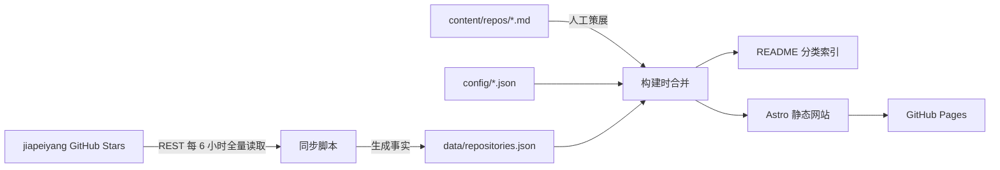

# 技术架构与数据模型

> 实施说明：本文记录调研阶段的 Astro 与 YAML frontmatter 方案。后续开发以 [`DEVELOPMENT_PLAN.md`](../DEVELOPMENT_PLAN.md) 为准，正式选择为 React/Vite + TOML frontmatter；事实层与人工内容隔离原则保持不变。

## 1. 架构结论

MVP 采用一个公开 GitHub 仓库完成数据、内容、网站和自动化：



三个所有权边界必须保持稳定：

- `data/` 只由同步脚本维护，保存 GitHub 事实。
- `content/` 只由人维护，保存个人判断与学习记录。
- `src/` 只负责把前两层组合成网站，不成为事实源。

## 2. 建议目录

```text
github-star-vault/
├── .github/workflows/site.yml
├── config/
│   ├── categories.json
│   └── project.json
├── content/
│   └── repos/
│       └── <repo_id>.md
├── data/
│   └── repositories.json
├── scripts/
│   ├── sync_stars.py
│   ├── verify_data.py
│   └── generate_readme.mjs
├── src/
│   ├── components/
│   ├── layouts/
│   ├── pages/
│   └── lib/
├── public/
├── tests/
│   └── fixtures/
├── README.md
├── astro.config.mjs
└── package.json
```

同步脚本优先使用 Python 标准库，避免只为三个分页请求引入 HTTP 依赖。Astro 是唯一主要应用框架；283 条数据在浏览器端直接搜索即可。

## 3. 数据获取

### 3.1 REST 请求

```http
GET https://api.github.com/users/jiapeiyang/starred
    ?sort=created
    &direction=desc
    &per_page=100

Accept: application/vnd.github.star+json
X-GitHub-Api-Version: 2026-03-10
Authorization: Bearer $GITHUB_TOKEN
```

`application/vnd.github.star+json` 返回 `starred_at` 与 `repo`。必须显式按 `created desc` 排序；按仓库最近 push 时间排序会在上游更新时重排分页，不能表达收藏顺序。

当前 283 条数据只需 3 页。脚本不能写死 3 页，应根据分页响应继续读取，直到没有下一页。

### 3.2 为什么每次全量对账

每轮将完整的当前集合与已有集合按 `repo_id` 比较：

```text
added   = current_repo_ids - previous_active_repo_ids
missing = previous_active_repo_ids - current_repo_ids
kept    = current_repo_ids ∩ previous_active_repo_ids
```

- `added`：新增到公开 Stars。
- `kept`：刷新名称、描述、Topics、语言和上游状态。
- `missing`：标记为不再出现在当前公开 Stars 中，退出默认视图。

`missing` 不能直接命名为 `unstarred`。它也可能表示仓库被删除、转为私有、用户 Profile 转为 private，或 API 权限变化。页面应使用“已退出公开 Stars”这一可验证描述。

### 3.3 仓库改名与重新 Star

- 数字 `repo.id` 是唯一主键，`full_name` 只是可变属性。
- owner 转移或仓库改名时更新 GitHub 事实，继续关联同一份个人内容。
- 重新 Star 后把 `source_status` 恢复为 `starred`，个人分类和笔记不变。
- 功能相似的项目不是数据重复，不自动合并。

## 4. GitHub 事实文件

建议使用一个稳定排序的 JSON 文件：

```json
{
  "schema_version": 1,
  "github_username": "jiapeiyang",
  "repositories": [
    {
      "repo_id": 1119232564,
      "node_id": "R_kgDO...",
      "full_name": "yzfly/awesome-skills-zh",
      "url": "https://github.com/yzfly/awesome-skills-zh",
      "description": "...",
      "homepage": null,
      "language": null,
      "topics": ["agent-skills", "claude-code"],
      "license_spdx": "MIT",
      "starred_at": "2026-09-04T12:54:28Z",
      "pushed_at": "2026-09-04T12:00:00Z",
      "updated_at": "2026-09-04T12:00:00Z",
      "stargazers_count": 123,
      "github_archived": false,
      "fork": false,
      "visibility": "public",
      "source_status": "starred",
      "first_seen_at": "2026-09-04T13:00:30Z",
      "missing_detected_at": null
    }
  ]
}
```

规则：

- 始终按 `repo_id` 或统一的 `starred_at desc, repo_id` 排序，避免无意义 diff。
- 只保存网站与 README 真正使用的字段，不保存完整 API 响应。
- 不保存 owner 邮箱、令牌、请求 header 或其他无关信息。
- `source_status` 只有 `starred` 和 `missing`；不推断无法证明的原因。
- `missing_detected_at` 是系统发现时间，不是实际取消 Star 时间。
- 首次导入的 283 个项目记录同一批次标识，用来计算默认 `imported` 状态。

如果认为长期保留没有人工内容的 `missing` 记录产生噪声，可以在真实数据积累后再制定清理规则。MVP 先保留，以支持重新 Star 和审阅变化。

## 5. 人工策展文件

只为真正整理过的项目创建 `content/repos/<repo_id>.md`：

```markdown
---
repo_id: 1119232564
category: ai-agent
resource_type: collection
stage: queued
tags:
  - agent-skills
  - 中文资源
note: 收集中文 Agent Skills，适合对照不同平台的 Skill 约定。
related: []
updated_by_user_at: 2026-09-04
---

## 学习结论

- 待学习。
```

规则：

- 文件名和 `repo_id` 必须一致。
- `learned` 至少有一条非空学习结论。
- `category`、`resource_type`、`stage` 必须来自配置中的枚举。
- `tags` 最多 5 个。
- 人工内容不重复保存语言、Stars 数或上游更新时间。
- 机器建议若加入，单独写入 `suggested_*` 字段或派生文件，不能覆盖人工字段。

一份 Markdown 既能保存结构化 frontmatter，也能逐步扩展长笔记；没有必要在初始化时生成 283 个空文件。

## 6. 合并优先级

构建时以 `repo_id` 连接 GitHub 事实与个人内容：

| 字段类型 | 唯一来源 | 覆盖规则 |
|---|---|---|
| 名称、URL、描述、语言、Topics、License、上游状态 | `data/repositories.json` | 每次同步刷新 |
| 主分类、资源类型、阶段、标签、备注、学习结论 | `content/repos/*.md` | 只允许人工编辑 |
| 默认阶段 | 构建规则 | 初始批次为 `imported`，后续新增为 `inbox` |
| 搜索索引、分类统计、README | 构建产物 | 每次从前两层重新生成 |

不存在“自动字段覆盖人工字段”的通用优先级，因为两类字段从数据契约上就不能同名。

## 7. 自动化工作流

建议一个 `site.yml` 同时响应 `push`、`schedule` 和 `workflow_dispatch`。原因是使用 `GITHUB_TOKEN` 推送的 commit 不会触发新的 `push` workflow，也不会自动触发另一个 Pages 构建。

推荐顺序：

```text
checkout
→ 完整读取公开 Stars
→ 校验并更新生成数据
→ 合并人工内容并生成 README
→ 运行数据测试与网站构建
→ 有语义变化时提交生成文件
→ 上传并部署当前构建产物到 GitHub Pages
```

调度建议：

```yaml
on:
  push:
    branches: [main]
  workflow_dispatch:
  schedule:
    - cron: "17 */6 * * *"
      timezone: "Asia/Shanghai"
```

权限按 job 最小化：同步与提交 job 使用 `contents: write`；部署 job 使用 `pages: write` 和 `id-token: write`。MVP 不创建用户 PAT。

网站展示两个时间：

- “最近成功检查时间”：由本次 Action 构建时注入，不要求为了更新时间单独 commit。
- “数据版本”：当前数据文件所在 commit。

## 8. 完整性与安全基线

### 8.1 分页失败不能覆盖完整快照

- **坏什么**：若第三页请求失败但前两页被写入，网站会误认为大量项目已退出公开 Stars，项目库内容错误。
- **多久一次**：频率未知。
- **代价分级**：A 级，数据错乱并影响主流程。
- **处理**：先在内存和临时文件中完成所有分页；全部请求成功、Schema 与唯一性校验通过后，再替换正式文件。验证失败则不 commit、不 deploy。

### 8.2 非空集合突然变为空不能发布

- **坏什么**：Profile 变 private、认证或接口异常可能让响应变为空，公开网站会被整体清空。
- **多久一次**：频率未知。
- **代价分级**：A 级，整个项目库不可用。
- **处理**：旧活跃集合非空而新集合为零时直接失败并保留旧快照，提示人工检查 Profile 与令牌。若用户确实要清空，使用显式维护操作。

### 8.3 人工内容不能被生成器触达

这是数据安全基线：同步脚本只允许写 `data/` 与明确的生成区，不扫描或重写 `content/`。Action 日志不打印令牌和完整请求 header，公开构建前验证所有活跃记录 `visibility=public`。

## 9. 验证规则

`verify_data.py` 至少检查：

- JSON 可解析且 `schema_version` 受支持。
- `repo_id` 唯一且为正整数。
- `full_name`、URL、`starred_at` 存在且格式正确。
- `source_status=starred` 的记录均为 public。
- 本次分页完整，接口总数与解析记录数一致。
- 每个人工文件能找到对应 `repo_id` 或被明确标为历史保留。
- 枚举合法、标签不超过 5 个。
- `stage=learned` 时有学习结论。

网站构建通过后，再做四个浏览器验收任务：按个人备注搜索、组合筛选、打开详情、检查移动端布局。

## 10. 暂不增加的复杂机制

- 不做进程锁或工作流重试队列。两个运行碰撞最坏是一次 push 失败，旧站仍可用，下次或手动运行能恢复；频率未知，代价为 B 级。
- 不做 ETag 分页缓存。三次请求远低于配额，只缓存第一页还会漏掉旧项目退出。
- 不做消息队列、数据库、GitHub App 或浏览器扩展。
- 不抓取所有 README、Release 或源码，不制造 N+1 API 请求。
- 不做自动 PR 流程。只有默认分支保护真实阻止 Bot 提交后再调整。
