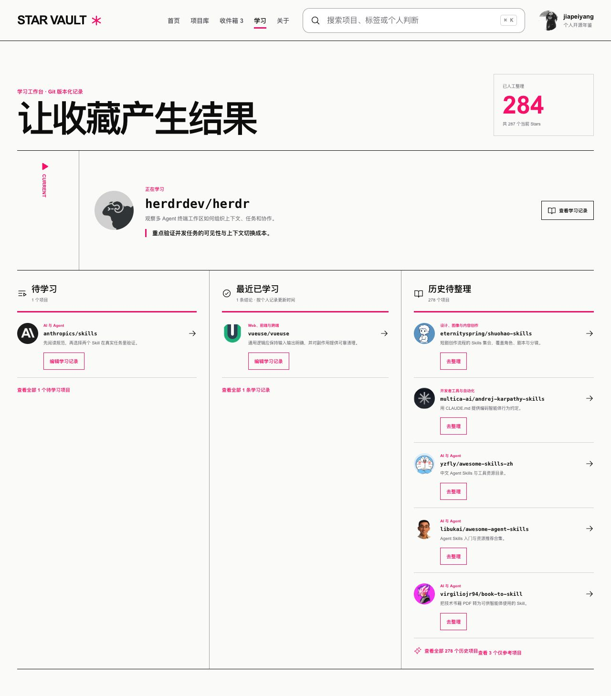
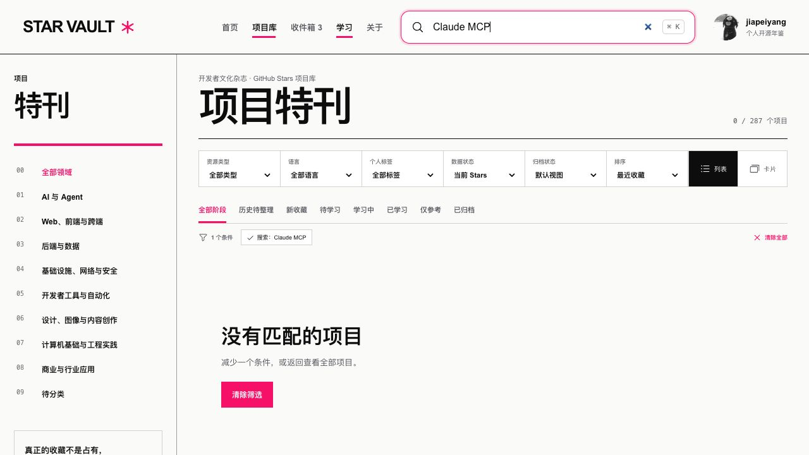
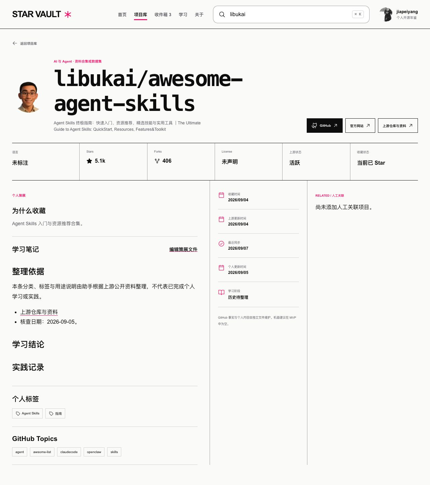
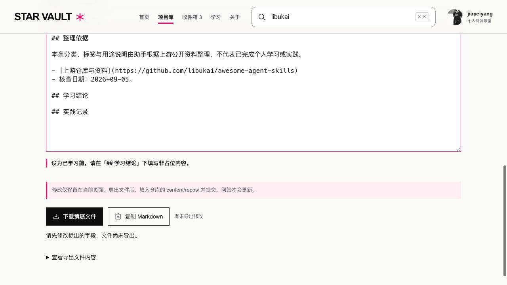

# Star Vault 当前项目评估与迭代计划

> 日期：2026-09-07。状态：评估与建议，尚未开始实施。
> 本轮范围：当前源码、线上目录、Actions、使用观察记录、已有测试及浏览器主流程。未修改业务代码、事实源或策展内容，未提交或部署。
>
> **后续定位调整（2026-09-07）**：用户明确以历史收藏回顾、检索和仓库理解为核心，并要求彻底删除学习阶段、笔记和学习完成统计，不保留旧内容兼容入口。本文的现状证据保留；其中学习动作、学习路径、学习产出指标及旧 v1.2A/B 排期属于已被替代的建议。当前优化计划以 [v1.2 收藏回顾与仓库解读](../DEVELOPMENT_PLAN_V1.2.md) 为准。

## 1. 判断与产品方向

Star Vault 已经是可运行、可持续同步的个人开源项目目录，分类、检索、完整笔记阅读和文件策展都已具备。下一阶段最值得投入的是「找回项目、做出学习选择、记录实际结果」这条使用链路。

现阶段应保留 Git 事实源、静态发布和方案 E 的视觉基线。已有证据支持修正内容语义、搜索和重访逻辑；还不足以支持引入数据库、语义搜索、在线写入或重做整个界面。

建议顺序：**v1.2A 修正语义与已有行为 → v1.2B 降低检索和学习操作成本 → 根据两周观察决定 v1.3 专题与学习内容建设。**

## 2. 当前基线：本地与线上分开看

| 指标 | 本地工作树 | 线上目录 |
|---|---:|---:|
| 当前公开 Stars | 284 | 287 |
| 历史记录总数 | 285 | 288 |
| 已分类 | 284 | 284 |
| 新收藏 inbox | 0 | 3 |
| imported | 278 | 278 |
| queued / learning / learned | 1 / 1 / 1 | 1 / 1 / 1 |
| reference | 3 | 3 |
| missing | 1 | 1 |
| 上游已归档 | 12 | 12 |
| 最近成功检查（北京时间） | 2026-09-05 03:33:51 | 2026-09-07 12:36:21 |

线上新收藏是 `localsend/localsend`、`humanlayer/skills` 和 `tiann/hapi`。因此，「284/284 全量分类」是之前批次完成时的事实；当前覆盖为 284/287，约 99.0%。本轮没有顺手分类这 3 个项目。

- 本地 HEAD：`a31488b`。检查时远端 main 为 `5c6f1e4d58c21a10460ba37c899e3e71ad131a42`，领先 9 次提交；compare 结果只有 `README.md` 和 `data/repositories.json` 变化，业务代码与本地一致。
- 最近 5 次 `site.yml` 定时运行均成功；最新运行：[34083714084](https://github.com/jiapeiyang/github-star-vault/actions/runs/34083714084)。这证明这些运行成功，不代表调度始终严格间隔 6 小时。
- [观察 Issue #1](https://github.com/jiapeiyang/github-star-vault/issues/1) 开放中，当前没有评论。原定 9 月 12 日和 9 月 19 日复盘尚未到期；缺少实际检索成功率、整理耗时和重访记录。
- 阶段数字是文件中记录的状态，不是本轮独立核实的个人学习成果。保留现有 6 条非 imported 记录，不推断或重写其真实性。
- 原有未提交改动 `app/qa/production-learning.png` 保留。

## 3. 已实现功能清单

| 能力 | 当前实现 | 判断 |
|---|---|---|
| Stars 同步 | 公开 API 分页、repo_id 合并、改名、退出 Stars、重新 Star、定时和手动触发 | 基础可用；失败保留旧快照有测试，不需重建同步系统 |
| 数据与内容分离 | GitHub 事实 JSON、人工 Markdown、构建 catalog、生成 README | 架构合适；「公开资料归纳」与「个人判断」在策展层还不够清晰 |
| 分类与资源类型 | 8 个领域、6 种正式资源类型，284 份策展文件 | 分类覆盖已不是主要瓶颈；新条目仍需整理 |
| 项目库 | 搜索名称、描述、标签、Topics、笔记正文；组合筛选；排序；列表/卡片；URL 状态 | 可用；多词检索、标签选择和返回上下文仍可改善 |
| 首页 | 领域入口、精选、当前关注、学习入口、重访 | 视觉辨识度明确；精选固定，随机重访存在覆盖缺陷 |
| 收件箱 | 新收藏/历史队列、30 条分页、队列搜索、选中项恢复、策展表单 | v1.1 已解决第 31 条不可达问题；历史队列的名称已落后于分类进度 |
| 详情与笔记 | 完整 Markdown、外链、元数据、阶段、标签、关联项目 | 阅读功能具备；用途说明、来源和个人内容的标题需要调整 |
| 策展文件编辑 | 新建/修改、字段校验、正文预览、复制/下载、未导出离开提醒、字段保留 | 文件生成闭环具备；正式生效仍依赖 Git 提交与发布 |
| 学习工作台 | 正在学习、待学习、最近已学习、历史项目、查看全部入口 | 目前偏状态展示；可增加更直接的学习动作入口 |
| 发布与验证 | Python/Node/Sites 测试、Actions、Pages、运行说明 | 工程基线健康；已有自动测试主要覆盖函数与构建，浏览器状态交互未纳入 CI |

现有内容还有 491 个不同标签，其中 364 个只使用一次；只有 2 个项目配置了人工关联。单次标签不等于错误，但把 491 个选项平铺成一个下拉框，不利于跨项目归纳和浏览。

## 4. 改进优先级与证据

### R1 / 高：澄清「已分类」「待选择」「已学习」

学习页同时显示「已人工整理 284」和「历史待整理 278」。这不是计数算法出错：`curated` 按主分类计算，`imported` 则仍是学习阶段。问题是两个不同维度被用同一个「整理」词表达。

详情中，助手整理的客观用途出现在「为什么收藏」下，正文来源说明出现在「学习笔记」下，分类核查日期被称为「个人更新时间」。正文已有来源声明，不能说完全没有标注；但列表、标题、日期与字段缺少一致区分。

建议：

- 「已整理」明确改为「已分类」；保留 imported 值兼容旧数据，将已分类 imported 条目呈现为「尚未选择学习计划」或「待选择」。
- 页面分别统计未分类、已分类但未安排学习、正在学习与有记录的已学习。分类状态优先从现有字段派生，不另加一套可漂移的进度状态。
- 用「项目用途」「整理依据」「个人学习记录」组织内容；只有明确的个人判断才用「为什么收藏」。标签默认称「策展标签」，更新时间默认称「策展更新时间」。
- 需要持久区分用途来源时，增加最小的可选来源字段，例如 `note_origin = public_sources | personal | unknown`。这是方案字段名，实施时须统一 Python、catalog、表单与导出契约。未知旧数据默认 unknown，不能把文件存在、阶段非 imported 或日期存在当成个人确认。
- 批次文档明确记录的 278 份公开资料归纳可按 repo_id 明确迁移来源；原有个人文字、正文和阶段不自动改写。导出必须保留来源字段。

证据：[学习视图](../app/src/views/LearningView.jsx#L12)、[阶段配置](../config/stages.json)、[catalog 合并与计数](../scripts/star_vault.py#L453)、[详情](../app/src/views/DetailView.jsx#L11)，以及截图 01、03。

### R2 / 高：改善普通多关键词检索

当前 `searchText(repo).includes(needle)` 要求整段连续命中。本轮线上输入 `Claude MCP` 返回 0 条；本地同版本算法核对发现，有 8 个项目的搜索字段同时含 Claude 和 MCP。`React Hooks` 当前也是 0 条，分词同时命中可找出 3 条。

建议先支持空白分词、所有词同时匹配和大小写归一，继续复用现有全文字段，不引入搜索服务。后续可显示命中的是仓库名、标签或哪段正文，让用户知道为什么找到了它。

还有两个使用成本：项目库搜索回车会重置已有筛选；筛选条件只能一键全部清除。建议项目库内回车保留筛选，提供单项移除。普通关键词搜索仍可从其他页面进入默认项目库。

标签先做可搜索选择和高频标签入口；按实际使用人工归并近义标签，保留有效长尾标签。无需一开始重做整套分类。

证据：[搜索实现](../app/src/domain/filters.js#L23)、[回车处理](../app/src/App.jsx#L78)、[标签选项与筛选](../app/src/views/LibraryView.jsx#L18)，截图 02。

### R3 / 高：修复随机重访的选择范围

当前公式是 `(getUTCDate() + pool.length) % pool.length`。日期只有 1～31；本轮候选池为 283 条时，只能选到 31 个下标，另外 252 个候选在池大小和顺序稳定时永远选不到。

建议让每个候选都有机会被选中，当前选择在阅读期间保持稳定，并可明确「换一个」。不需要历史推荐日志、缓存或后台调度。

证据：[首页重访逻辑](../app/src/views/HomeView.jsx#L37)；本轮按 1～31 日枚举，覆盖 31/283，约 10.95%。这是代码和数据推导，未做长期使用实验。

### R4 / 中高：减少学习动作的操作成本

当前操作是「打开详情 → 编辑策展文件 → 找到学习阶段 → 修改 → 导出 → 放回仓库 → 审阅并提交 → 等待发布」。这套流程正确地把下载和正式保存分开，但仅改变一个学习阶段也需要理解整个文件流程。

建议在详情和学习页增加「加入待学习」「开始学习」「记录结论」入口，仍打开现有文件表单，只预选阶段并定位相关字段。进入表单就应看见保存方式。未发布之前，列表计数不能假装已经更新。

先记录几次真实操作的耗时，再决定是否需要本地导入辅助或草稿恢复。不能从操作步骤多，直接推出必须开发账户、数据库和在线编辑。

证据：[学习页动作](../app/src/views/LearningView.jsx#L14)、[表单与导出反馈](../app/src/components/CurationForm.jsx#L44)、[操作指南](07-curation-guide.md)，截图 04。未测量用户完成一次有效整理的实际用时。

### R5 / 中：让杂志首页更适合持续使用

- 「本期精选」固定优先选择 `anthropics/skills`，目前没有换期配置；以后需要由实际策展选择驱动。
- 「当前关注」在学习中/待学习之外会补入已分类项目，但已分类不证明用户当前关注。可以改为「继续学习」与「近期入库」等可解释栏目。
- 首页「最近学习记录」取第一个 learned，学习页则按个人记录更新时间排序。当前只有 1 条 learned，尚未出现可见排序错误；新增记录前应统一规则。
- 最近成功检查只显示日期，难以判断当前距同步多久。可显示时分和「计划每 6 小时检查」，不承诺 Actions 准点。
- 返回项目库的按钮会滚到顶部；筛选 URL 已保留，但连续查看多个结果缺少回到原条目的机制。改进时复用路由与浏览器历史，不引入全局状态库。

证据：[首页](../app/src/views/HomeView.jsx#L27)、[学习记录排序](../app/src/domain/inbox.js#L21)、[导航滚动](../app/src/hooks/useNavigation.js#L26)。这些属于源码已确认的行为，除当前页面展示外，未逐项做长期交互测量。

### R6 / 中：补关键交互验证与可访问性语义

现有表单标签、错误关联、导出状态提示、Markdown 安全链接和字段保留值得保留。主导航、分类和阶段按钮主要依赖视觉 class 表示选中；可以补适当的 `aria-current` / `aria-pressed`，并检查页面切换后的焦点。

自动测试已经覆盖同步失败、重命名、missing/restar、全文字段、路由序列化、队列和导出到 Python 的契约。但没有把 React 导航、未导出草稿取消离开、筛选回车行为接到自动浏览器回归中。补少量真实旅程即可，无需为所有展示组件镜像写测试。

目前没有测到性能瓶颈。线上 catalog 为 633,335 字节；本轮 JS 构建约 442.53 kB、gzip 131.19 kB；项目库一次渲染全部匹配项。分页、延迟加载或拆分阅读模块可以在实际卡顿或浏览负担出现时评估，不能仅凭这些体积判定「性能差」。

证据：[导航语义](../app/src/components/Header.jsx#L20)、[列表渲染](../app/src/views/LibraryView.jsx#L38)、[测试命令](../app/package.json)、[工作流](../.github/workflows/site.yml)。

## 5. 分阶段迭代计划

以下工作量是排期参考，以开始实施后的有效开发日计算，不是交付日期承诺；每批均包含相应验证。发布、提交与内容迁移按确认后的范围执行。

| 批次 | 目标与范围 | 完成标准 | 参考工作量 |
|---|---|---|---|
| v1.2A-1 | 统一分类/学习词义、内容来源和时间文案；必要的最小来源字段迁移 | 同一项目可明确显示已分类但未安排学习；公开归纳不再显示为个人实践；旧正文、标签、关联和阶段完整保留 | 1～2 日 |
| v1.2A-2 | 多词搜索、项目库回车保留筛选、随机重访覆盖修正 | 冻结 fixture 中 `Claude MCP` / `React Hooks` 不再因空格整体匹配漏掉已知结果；所有重访候选均可被选择 | 约 1 日 |
| v1.2B | 学习动作入口、可搜索标签、单项移除筛选、回到原条目、少量交互与可访问性回归 | 从条目直接进入对应阶段/结论编辑；未发布不改变正式计数；返回能接着浏览；键盘选中状态可识别 | 1～2 日 |
| 使用观察 | 继续既有 9/12、9/19 复盘；记录实际找回、整理与学习使用 | 有真实检索任务与操作耗时，版本分段清楚；没有观测就写未知 | 与开发并行，不计开发日 |
| v1.3 候选 | 少量任务专题、学习路径、精选内容轮换、真实学习记录积累 | 每个专题有明确用途与来源；学习结论只来自实际使用；路径能直接进入现有条目 | 复盘后再定范围 |

推荐先确认 v1.2A，解决已经有证据的问题。v1.2B 可以拆开交付；若使用观察证明编辑下载步骤几乎没有阻力，就不做本地导入辅助。

### v1.2 的实施边界

1. 先固定代码基线并读取最新同步数据；保留本地已有改动。日常同步只通过现有脚本执行，禁止手改事实 JSON 或提交 public/data 构建产物。
2. 如增加来源字段，先扩展 Python 读取、catalog 输出、前端回填和导出保留，再迁移有明确来源证据的文件。不要先写新字段导致旧导出器报未知字段或丢失内容。
3. imported 的语义调整以展示和派生分组为主，保留内部值与旧 URL。新收藏也可能「已分类但未决定是否学习」，不能只为第一次历史导入设计规则。
4. 学习动作仍生成可审阅的 Git 文件；清楚区分「有未导出修改」「已导出待提交」和正式站的数据。页面不能仅因发起下载就宣称保存成功。
5. 不用脚本自动补个人学习结论，不批量把 imported 改为 queued/learned，不把未知来源强行视作个人内容。

### v1.3 的具体候选

可从「Agent 工程与 Skills」「前端基础与源码」「开发工具与效率」中选择少量实际需要的主题。这些是基于目录内容的候选，不是已经确认的个人学习目标。

每个专题先精选 5～8 个项目，说明适用场景、项目之间的差异、推荐阅读顺序，以及一个可以完成的小任务。没有顺序需求时复用标签和 URL 筛选入口；确实需要手工顺序与讲解时，再增加简单 Git 文件。关联项目优先补在这些真实专题里，无需建立知识图谱服务。

「个人成果」建议继续使用已有 Markdown，分别记录尝试目标、做了什么、得到什么结论、可核对的代码或结果链接。可以先形成 2～3 条真实记录，再判断模板是否足够，不能由助手代写不存在的实践。

## 6. 验收与决策门槛

### v1.2 必须验证

- 现有 17 项 Python、19 项前端、4 项 Sites 测试继续通过；生产构建通过。增加测试只针对新契约和本次修改触达的失败路径。
- 用旧个人记录、公开资料归纳和来源未知三类 fixture，验证读取 → 编辑 → 导出 → Python 解析 → catalog → 展示的来源和内容不丢失。
- 分类覆盖计数不改变个人学习阶段；来源迁移前后正文、repo_id、related、标签与阶段保持语义一致。
- 多词、单词、空白、大小写、零结果和组合筛选均按明确规则处理；用稳定 fixture 验证，不把线上不断变化的总数硬编码为测试期待值。
- 随机重访的测试可控制抽样值，验证首尾与全部索引都可达、候选过滤正确、空候选可处理；不写概率易抖动的随机测试。
- 浏览器验证：筛选 → 搜索回车 → 详情 → 返回；学习动作 → 修改 → 取消离开 → 草稿保留；无结论 learned 导出失败；有效文件在隔离内容目录验证后回读。不得为验收写入真实个人结论。
- 桌面及 390px 视口验证检索、正文和表单；验证焦点和选中状态，不宣称完成所有设备或完整 WCAG 认证。

### 使用观察的建议记录

复用 [既有观察文档](06-operations-and-observation.md) 和 Issue #1，不加埋点 SDK。本轮未发表 Issue 评论。

| 观察项 | 建议采样 | 决策用途 |
|---|---|---|
| 已知项目找回 | 10 次真实检索，记录输入、结果与大致耗时 | 判断普通分词和标签是否够用 |
| 学习阶段/笔记维护 | 至少 5 次，分别记录填写与文件提交耗时 | 判断是否要本地导入辅助、草稿恢复或远端编辑 |
| 旧项目重访 | 记录重访后是否采取下一步行动 | 判断重访和专题入口是否有用 |
| 学习产出 | 记录新产生的实际结论及依据 | 验证工作台是否帮助学习；不以分类数替代 |

这些采样数是建议，不是已经完成的观测。当前不能报告使用转化率或宣称用户需要某种新能力。

后续只有出现具体证据才扩大架构：普通关键词多次找不到已知项目时，再讨论索引或语义搜索；文件步骤持续成为主要阻力时，再比较本地辅助与在线编辑；6 小时窗口实际阻断任务时，再讨论更短同步周期或扩展。AI 分类也需有持续整理成本的记录，本次全量归纳完成不能当成后台服务必要性的证据。

## 7. 本轮浏览器审视证据

线上主流程：学习工作台 → 多词搜索 → 已分类项目详情 → 编辑并验证导出限制。截图均为本轮保存后重新读取检查的原始页面图。

| 步骤 | 页面与总体状态 | 观察与建议 |
|---|---|---|
| 01 | 学习工作台：可用，进度语义需改进 | 284 已人工整理与 278 历史待整理并存；学习项入口有效，但摘要更偏状态展示 |
| 02 | 项目库检索：可用，多词搜索存在明确缺口 | `Claude MCP` 得到 0/287；空态和清除按钮明确，但没有拆词匹配 |
| 03 | 项目详情：完整可读，来源层级需改进 | 能读到助手公开资料来源声明；「为什么收藏」「学习笔记」「个人更新时间」仍混用，空学习章节占据阅读空间 |
| 04 | 文件编辑：校验有效，保存步骤较多 | 未填写结论而选择 learned，导出被阻止，错误和状态提示清楚；正式保存依赖 Git，不能把下载当作发布 |

可访问性方面，当前可见的表单标签、键盘焦点轮廓和错误文字是优点；筛选及导航的程序化选中状态、路由切换焦点需要改善。本轮没有进行屏幕阅读器、色彩对比度计量、手机真机或全部键盘路径测试。

## 8. 本轮验证结果与「我没有防什么」

已执行：

- `python3 -m unittest discover -s tests -v`：17/17 通过。
- `python3 scripts/verify_data.py`：active=284、total=285、curations=284 通过。
- `npm --prefix app run test`：19/19 通过。
- `npm --prefix app run test:sites`：4/4 通过。
- `npm --prefix app run build`：通过；生成文件未手改、未提交。
- 本地构建预览成功，首页非空；本地首页和已检查线上流程的浏览器错误/警告日志为空。
- 当前线上 catalog、远端 compare、最近 5 次 Actions 和观察 Issue 已只读核对。
- learned 空结论的浏览器导出拦截已验证；之后恢复表单原阶段，确认无未导出修改，没有新增下载文件或修改线上内容。

我没有防什么：

- 本轮是评估，没有实施上述修复，也没有重新执行发布、真实 Star/Unstar 或有效策展文件提交。
- 未验证每个上游仓库当前仍可运行、每条公开归纳仍准确，未把现有阶段记录当成经过独立核实的个人成果。
- 未执行生产安全审计、负载测试、网络故障注入、跨浏览器全量回归或本轮移动端复验；测试通过只覆盖已有测试和上述检查路径。
- 不用新增数据库、锁、重试队列、缓存层、后台自动分类或行为采集来覆盖尚未出现的需求。
- 内存草稿在浏览器强制关闭时仍可能丢失；导出文件需要审阅和提交，这是当前已知边界，是否改善要结合真实使用记录。

证据清单见同目录 [本轮快照摘要](audits/2026-09-07/evidence.json)。
