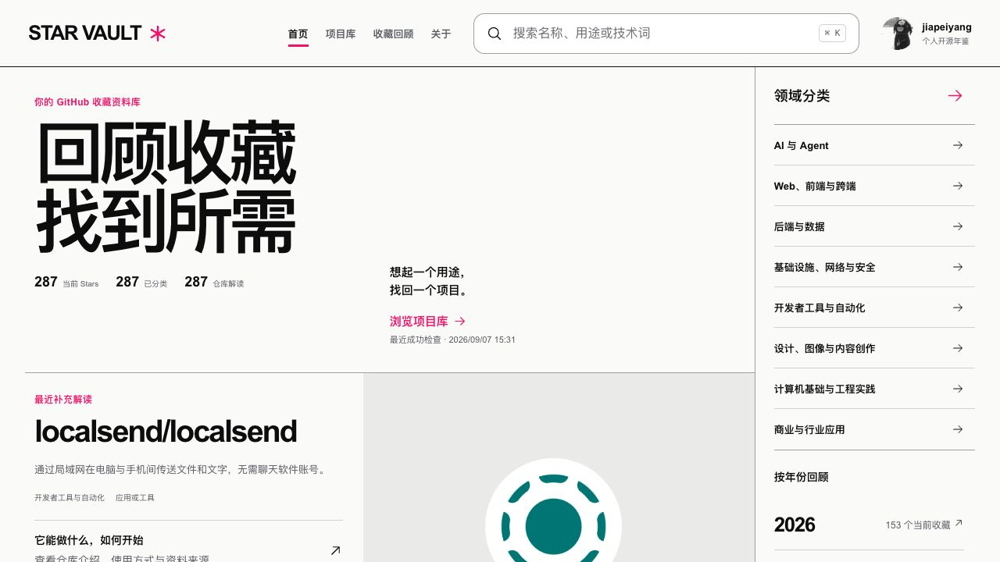
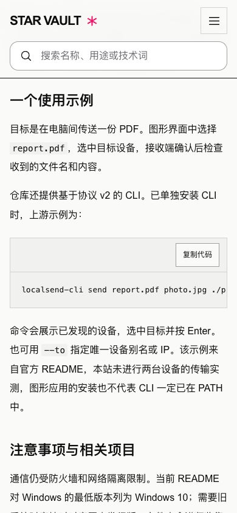

# v1.2 开发交付

> 日期：2026-09-07。分支：`codex/star-vault-v1.2`。
> v1.2A / v1.2B 已完成本地实现；v1.2C 已处理并验收全部 287 个冻结条目。本记录保存开发验收范围；用户已授权提交并发布到 GitHub Pages，线上结果见 [发布流水线](https://github.com/jiapeiyang/github-star-vault/actions/workflows/site.yml)。

## 已实现

- 彻底删除学习页面、阶段配置与筛选、笔记/实践记录章节、完成计数及旧校验。失效学习地址回到项目库，旧 stage 参数被清除。
- 资料文件改为摘要、仓库解读、来源与核查日期。个人归档独立，原 284 份资料的 ID、分类、类型、标签、关联和个人归档逐字段对照无差异。
- 详情提供用途、场景、开始步骤、示例、注意事项、来源，支持章节目录和代码复制。
- 首页围绕最近收藏、分类、年份、解读与随机重访；旧收藏候选全部可达。修复解读入口残留的头像列，头像按方形比例显示。
- 项目库支持多词同时匹配、命中片段、标签输入、年份/日期筛选、单项移除，回车保留筛选。
- 收藏回顾按北京时间分组，默认包含已收录的历史记录；直达地址与导航入口一致，显式当前 Stars 筛选刷新后保留。
- 详情返回保留浏览条件与位置。资料维护和文件导出保留，移除学习字段；旧个人章节在导出前即被阻止。

## 数据与全量内容

通过同步脚本取得 287 个当前 Stars、288 条历史记录、12 个上游归档项目。使用线上既有快照作为 `--previous` 基线，所有共同记录的 first_seen_at 保持一致；没有手工写入事实字段。

当前 287 项均有分类与经核查的正文：284 篇用途、使用或资料导航解读，3 篇资料受限的现状说明，待处理 0。284 篇中包括 GSD 旧仓库的迁移导览，新 GSD Core 另有解读；不据此声称旧版本仍可运行。全部条目及正文校验值见 [全量验收](content-batches/v1.2-acceptance.md) / [JSON 记录](content-batches/v1.2-acceptance.json)。

| 资料受限项目 | 当前边界 |
|---|---|
| SocialSisterYi/bilibili-API-collect | 当前仅保留关停公告，原文档与源码已移除。 |
| Binaryify/NeteaseCloudMusicApi | 当前说明停止维护，没有可核查的安装与接口契约。 |
| oe/mac-env | README 安装文件缺失；所读源码仅回显选择，不能提供已核实的一键安装路径。 |

这三项仍有现状解读，因此界面的“仓库解读”显示 287；完整用途/使用覆盖单独统计，不能把现状说明算成可运行指南。冻结范围以实施时快照为准；唯一 missing 记录 octocat/Hello-World 保留历史事实与回退入口，不在本批 287 个当前收藏中。

内容按 12 个代表仓库、20 个后续条目与三组 85 个条目组织。每位作者逐仓查阅相关资料，主代理抽查用途、命令与版本，另做 8 篇交叉复核。287 份主 README 的字节数和 Git blob SHA 均通过核对，额外文档、源码与 Issues 见各批来源清单。

所有示例都注明未执行；没有把上游宣传或内容整理写成用户个人实践。教程、书籍和上游文章中的学习主题仍属于仓库资料。

## 工程验证

- Python 22 项、前端 24 项、Sites 4 项测试通过。
- `verify_data.py`、README 生成、catalog 生成、GitHub Pages 模式生产构建通过；未改变 Sites Worker 与既有打包结构。
- 删除范围核对：源资料与 catalog 无旧学习字段/章节，当前界面没有旧学习操作；原 284 份分类元数据和共同记录首次收录时间无差异。
- 构建 JS 418.59 kB（gzip 126.92 kB），CSS 48.53 kB（gzip 8.83 kB）。
- 全量 catalog 为 1,024,044 bytes，本地 gzip 为 285,753 bytes。仍采用静态数据与现有字符串检索，没有引入额外索引服务或缓存层。
- 10 个已收录项目的用途检索用例全部命中；本机 Node 24 / macOS arm64，每个查询预热后运行 20 次，中位数约 0.96–1.45 ms，P95 最大约 1.59 ms。此测量仅覆盖筛选函数，不包含网络与浏览器渲染，不是线上性能承诺。[测量记录](audits/2026-09-07/v1.2-search-check.json)

## 浏览器验收

使用 Codex 内置浏览器验收。最终复查基于 `/github-star-vault/` 构建产物；返回位置、剪贴板复制与有效下载回读复用本轮功能开发阶段的证据，对应逻辑之后未再修改。

- 首页显示当前 Stars / 已分类 / 仓库解读均为 287；新增内容可正常打开，资料受限项目清楚显示现状。
- “字体 连字”从首页搜索进入项目库，找到 Maple Mono 并显示命中高亮。首批阶段已验证“Claude MCP”的分词与领域筛选后回车保留；全量正文加入后其命中数量会自然增加。
- 收藏回顾默认 288 条，当前 Stars 范围为 287 条，刷新保留选择；2021 年为 83 条。实际点击前滚动位置 1253px，详情返回后恢复年份与该位置。
- 章节锚点与直接章节地址正常定位；代码复制已实测剪贴板确切内容，不是空字符串。
- 390px 下首页与详情无页面横向溢出；长代码块在自己的 356px 容器内横向滚动，正文六章正常呈现。
- 桌面解读入口文字区约 364px，头像 175×175；390px 下入口约 327px，头像 130×130，已修复旧布局导致的窄列问题。
- 空摘要、旧个人章节均阻止导出；测试后恢复原值并确认无未导出修改。有效浏览器下载曾在隔离目录由 Python 回读，摘要、正文、来源与归档信息正确。
- 最终浏览器未记录 error / warn。

原生离开确认框的“取消”路径无法在当前工具中稳定操作，未记作通过。它仍使用已有浏览器原生确认方式；可在普通浏览器修改摘要、点击返回并取消，预期停留原表单且保留修改。

## 我没有防什么

- 未运行上游程序、模型、数据库、支付、真实账号或跨设备示例；未验证所有合集外链长期有效。
- 未恢复建库前或两次同步间未记录的 Star/Unstar 历史，也未恢复上游已撤下的使用资料。
- 未做 Safari/iPhone 真机、完整屏幕阅读器或正式负载测试；原生确认取消路径限制如上。
- 未增加在线保存或草稿持久化，强制关闭页面不能保证找回未导出的内容。
- 开发验收与线上部署分别核实，不能仅凭本地构建成功认定站点已经更新。

本轮两个预览标签已关闭，临时视口已恢复；开发与构建预览进程均已停止，lsof 确认 4178 / 4179 端口释放。用户原有浏览器页面与截图保留。
